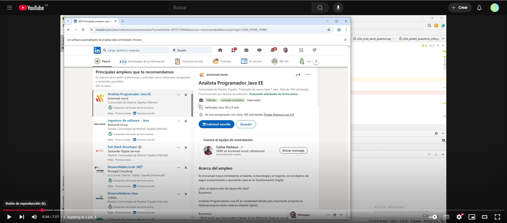

## LinkedIn AutoApply GPT Agent

## 🔍 Overview

This project automates job applications on LinkedIn using a combination of Selenium for browser automation and OpenAI GPT (LuisAssistant) for answering form questions and generating cover letters. The system is tailored for technical users—developers, recruiters, and job seekers comfortable with Python—and is fully script-driven.

####LinkedIn buttons must be displayed in **Spanish** to ensure correct automation behavior.

### 🎯 Core Features
- Automatically logs into LinkedIn using credentials or cookies
- Scrapes job listings and applies to “Easy Apply” jobs
- Detects and answers job application form questions using GPT
- Generates customized cover letters for each job
- Tracks submitted applications and logs all outputs
- Supports both LinkedIn Easy Apply and External Apply workflows

### 🧠 GPT Integration
- Uses GPT-4 (e.g., gpt-4o-mini) via OpenAI API
- Context-aware responses using a vector store of the applicant's CV and project documents
- Dynamic prompt generation and response validation
- Optional fallback to cached Q&A answers

### 📺 Demo Video
[](https://www.youtube.com/watch?v=du278-Dy2ac)
Watch it in action here:   [YouTube Demo](https://www.youtube.com/watch?v=du278-Dy2ac)

### Requirements
- Python ≥ 3.9
- Chrome WebDriver
- OpenAI API Key + vector store setup
- Spanish-language LinkedIn interface

### 🚀 Run It
```bash
python 02_Run_get_question_and_chatLinke.py
```
After LinkedIn login, navigate to a job listings page manually if needed. The bot will scroll through jobs, attempt to apply, and track each result.

---


##  How to Use the LinkedIn Auto-Application Bot with GPT Agent


This project automates job applications on LinkedIn using Selenium and OpenAI GPT (GPT_Assistant). Below is a structured summary and user guide.

---

### **🚀 Setup Instructions**

1. **Register and Configure the GPT Agent**

   * Sign up at [platform.openai.com](https://platform.openai.com/)

   * Create an API key and paste it into `agente.txt`

Format:

 CopiarEditar  
`sk-XXXXXXXXXXXXXXXXXXXXXXXXXXXXXXXXXXXXXXXX`

*   
  * A demo video is available here: [📺 YouTube Demo](https://www.youtube.com/watch?v=du278-Dy2ac)

2. **Install Required Packages**

   * Python ≥ 3.9

   * `selenium`, `openai`, `bs4`, `pandas`, `langdetect`, `python-docx`, etc.

   * (Optional) Use a virtual environment for clean setup.

**Run the Bot**

 🚨 You must run:

 bash  
CopiarEditar  
`python 02_Run_get_question_and_chatLinke.py`

3.  This will:

   * Log into LinkedIn

   * Browse and scroll through job offers

   * Parse job data

   * Auto-apply using GPT-powered answers and custom cover letters

   * Track applications in a CSV

---

### **🧠 GPT Agent Integration**

The `GPT_Assistant.py` class uses your API key (from `agente.txt`) and GPT-4 (`gpt-4o-mini`) to:

* Generate concise answers for form questions

* Choose dropdown or radio options

* Create cover letters in the job’s language

This ensures personalized and human-sounding applications.

You've assembled a sophisticated pipeline that uses Selenium and OpenAI's GPT-4 to automatically apply to LinkedIn job offers. Here's an in-depth explanation of how each component works, how they interconnect, and what role each file plays in the system:

---

## **🧠 GPT AGENT CORE**

### **1\. `GPT_Assistant.py`**

Implements the interface to OpenAI's API using GPT-4. It uses a vector store to maintain memory across interactions and provides the `ask()` method used everywhere GPT is invoked.

### **2\. `agente.txt`**

Stores the API key securely, which is read by `GPT_Assistant`.

---

## **📄 MAIN EXECUTION SCRIPT**

### **3\. `02_Run_get_question_and_chatLinke.py`**

This is the orchestrator script. It:

* Logs in to LinkedIn (`utils_login.py`)

* Scrolls through jobs (`utils_move.py`)

* Extracts job details (`utils_get_oferts.py`)

* Applies to each job:

  * "Easy Apply": handled internally with GPT

  * External Apply: HTML saved for later parsing

* Saves job and question data using `utils_save.py`

---

## **🔐 AUTHENTICATION**

### **4\. `utils_login.py`**

Manages login to LinkedIn via either saved cookies or credentials. Ensures a session is active before scraping.

---

## **🔍 JOB SCRAPING**

### **5\. `utils_get_oferts.py`**

Extracts job metadata and full description using BeautifulSoup. Also determines:

* Job title, company, location

* Easy Apply vs External Apply

* Job description language

---

## **🤖 APPLICATION HANDLING**

### **6\. `utils_collect_questions.py`**

The most critical logic — this is where actual job applications are submitted:

* Detects Easy Apply or External

* Uploads CV and cover letter

* Answers questions using GPT (`GPT_Assistant_utils`)

* Fills out forms (radio, dropdown, input fields)

* Submits the application

* Logs to `_submitted_jobs.csv`

### **7\. `utils_collect_questions_Utils.py`**

A utility toolkit to support `utils_collect_questions.py`:

* Parses and locates question elements

* Determines if already answered

* Handles format validation and retries

* Uploads CV/cover letter

* Navigates Easy Apply modal steps

---

## **📄 COVER LETTER GENERATION**

### **8\. `utils_cover_leter.py`**

* Uses GPT to write a custom cover letter per job

* Saves it as `.docx`

* Uploads it through Selenium

---

## **📑 FORM & QUESTION EXTRACTION**

### **9\. `utils_XPathBuilder.py`**

For externally hosted applications:

* Parses downloaded HTML forms

* Extracts fields and buttons using BeautifulSoup

* Saves them to `.json` for offline processing

---

## **💬 QUESTION CLASSIFICATION & ANSWERING**

### **10\. `chat_send_question.py`**

Batch processes and answers all questions scraped via form collection:

* Normalizes and deduplicates

* Answers each using `GPT_Assistant`

* Saves results to a CSV cache

### **11\. `utils_chat_send_question.py`**

Classifies question type (text, number, yes/no), normalizes formatting, and assists the chat module.

---

## **🤝 GPT ASSISTANT UTILITIES**

### **12\. `GPT_Assistant_utils.py`**

* Interprets how to use GPT to answer dropdowns, radios, and edge cases

* Handles retries due to format errors

* Generates "fake but plausible" address if needed

---

## **🧭 NAVIGATION UTILITIES**

### **13\. `utils_move.py`**

Handles:

* Human-like scrolling behavior

* Clicking logic (retry on fail)

* Ensures elements are visible and clickable

### **14\. `utils_next_page.py`**

Deals with:

* Pagination (click next page)

* Modal closing

* Submitting final application ("Revisar" and "Enviar")

---

## **🧮 DATA PERSISTENCE**

### **15\. `utils_save.py`**

* Saves job data and answered questions to CSV/JSON

* Ensures daily filenames for traceability

---

## **📋 OUTPUT FILES**

* `_submitted_jobs.csv`: Tracks which jobs were successfully applied to

* `output_form_questions.csv`: Extracted questions from forms

* `CACHE_answered_questions_linke.csv`: Stores previously answered GPT questions

---

## **🔁 HOW IT ALL FLOWS**

scss

`02_Run_get_question_and_chatLinke.py`

 `├──> linkedin_login()`

 `├──> smart_scroll_jobs_list()`

 `├──> get_job_offers() + parse_linkedin_job()`

 `├──> click_easy_apply_if_exists()`

 `│    ├──> handle_easy_apply()`

 `│    │    ├──> Upload CV (based on city and tech)`

 `│    │    ├──> Upload GPT-generated cover letter`

 `│    │    ├──> Answer form questions via GPT (GPT_Assistant_utils)`

 `│    │    └──> click_review_and_submit()`

 `│    └──> OR handle_external_apply() + save HTML`

 `├──> go_to_next_page()`

 `└──> Save to JSON and CSV`

---

Would you like a visual flowchart or architecture diagram for documentation or presentation?

To run the `GPT_Assistant` GPT agent correctly, you need two key values:

---

## **✅ Required Values to Run `GPT_Assistant.py`**

### **1\. OpenAI API Key**

This is needed to authenticate and use the OpenAI GPT API.

**Where it's used**:

 `with open(api_key_path, "r", encoding="utf-8") as f:`

    `api_key = f.read().strip()`

* 

**How to provide it**:  
 Create a file called `agente.txt` (or the file path you're passing to `GPT_Assistant(api_key_path=...)`) and paste your secret API key inside it.

 **Example `agente.txt`:**

 `sk-XXXXXXXXXXXXXXXXXXXXXXXXXXXXXXX`

*   
* **How to get your key**:  
   Go to [https://platform.openai.com/account/api-keys](https://platform.openai.com/account/api-keys), log in, and generate a new key.

---

### **2\. Vector Store ID**

Used to query over files or documents you’ve uploaded and indexed using OpenAI’s **file search** tool (like a resume or job history document).

**Where it's used**:

 `self.vector_store_id = "xxxxx"  # <-- ADD your vector store ID here`

*   
* **How to get it**:

  * Upload your files to the [OpenAI file management dashboard](https://platform.openai.com/files)

  * Use OpenAI’s [vector store tool](https://platform.openai.com/docs/assistants/tools/file-search) to create a vector store

  * Copy the `vector_store_id` shown after creation

---

## **🔧 Example Configuration**

`assistant = GPT_Assistant(api_key_path="chatGPT/agente.txt")`

And in `GPT_Assistant.py`:

`self.model = "gpt-4o-mini"`

`self.vector_store_id = "vs_abcdef1234567890"`

---

Would you like a helper script to upload files and print the `vector_store_id` for you?

Here's how to **create an OpenAI GPT Agent** that answers job/resume-related questions like **Luis Lecinana**, using your example and style—perfectly adapted to [OpenAI's Prompt Playground](https://platform.openai.com/playground/prompts?preset=preset-CGxXtEIRdbmfZ6kqPxDy0O0d).

---

## **✅ How to Create a GPT Agent for Resume-Based Job Question Answering**

### **🧠 Goal**

Set up a GPT agent that responds **in character** as Luis Lecinana, using resume data, project summaries, and behavioral rules. Ideal for job application forms, recruiter chats, or automated LinkedIn bots.

---

## **🔧 Step-by-Step: Agent Setup in OpenAI Playground**

### **1\. Go to:**

📍 [https://platform.openai.com/playground/prompts](https://platform.openai.com/playground/prompts?preset=preset-CGxXtEIRdbmfZ6kqPxDy0O0d)

### **2\. In the prompt box, paste your instruction file content**

Use the format you've already created. Here’s a more concise intro to use:

---

### **🏁 System Prompt Example:**

css

`You are Luis Lecinana Castillo, answering as yourself.`

`Respond confidently to questions from recruiters, HR teams, or job applications.`

`Always speak in first person. Be clear, optimistic, and concise.`

`Pull from the following resume and project context to answer:`

### **Then continue with your sections:**

* **IDENTITY & CONTACT INFO**

* **OBJECTIVE**

* **EXPERIENCE**

* **TECH STACK**

* **PROJECT SUMMARIES**

* **SALARY & AVAILABILITY**

* **BEHAVIOR RULES**  
   → e.g., Always say “YES” when availability is asked  
   → Use “Dear {company} Team” in cover letters  
   → Always provide salary if asked

---

### **3\. In the “Message” input, try real recruiter questions:**

Examples:

* *Are you eligible to work in Spain?*

* *What is your expected salary?*

* *Do you have experience with TensorFlow or OpenCV?*

* *Can you start next week?*

### **4\. Optional File Integration (for API)**

If you're using the GPT API (like in `GPT_Assistant.py`), you can:

* Upload structured `.txt` files like `Luis Lecinana CV.txt`

* Create a vector store

* Query using the `vector_store_id`

---

## **🔗 Behavior Tips for GPT**

| Scenario | Expected Output |
| :---- | :---- |
| “Are you available for shift work?” | “Yes, I’m flexible with schedules.” |
| “Do you have experience with multithreading?” | “Yes, I used multithreading extensively at SealPath for secure app development.” |
| “Expected salary?” | “My expected salary range is €28,000–€32,000.” |
| “What’s your GitHub?” | “You can see my projects at [http://github.com/Leci37.”](http://github.com/Leci37.%E2%80%9D) |

---

## **🧩 Connect with Your Agent in Code (`GPT_Assistant.py`)**

Once your prompt is tested in Playground:

1. Copy the system prompt into your GPT agent as a base

2. Upload your `.txt` files (CV, Q\&A, projects)

3. Use `vector_store_ids` to query

`self.vector_store_id = "vs_abc123..."  # from OpenAI dashboard`

Now your agent will act like a professional job applicant, giving human-like, resume-driven answers\!

---

Would you like a downloadable `.txt` version of your prompt formatted for agent configuration?

Here's a comprehensive breakdown of the **files your bot reads and writes**, along with their **purpose**, **content**, and **how they're used across the project**:

---

## **📂 INPUT FILES (READ)**

| File | Purpose | Read by |
| :---- | :---- | :---- |
| **`agente.txt`** | Stores the **OpenAI API key** used to authenticate GPT requests | `GPT_Assistant.py`, `GPT_Assistant_utils.py`, `chat_send_question.py`, etc. |
| **`linkedin_cookies.pkl`** | Contains previously saved **LinkedIn session cookies** to bypass login | `utils_login.py` |
| **`data/questions_output_2025_05_07.csv`** | Contains previously scraped LinkedIn form questions | `chat_send_question.py` |
| **`data/response_cache/CACHE_answered_questions_linke.csv`** | Cache of GPT-answered questions to avoid recomputation | `utils_collect_questions.py`, `chat_send_question.py` |
| **`data/jobs_data_2025_05_05.csv`** | Contains raw HTML paths for external job applications to parse | `utils_XPathBuilder.py` |
| **`Data/solicitud_external/{domain}_{job_id}.html`** | Saved HTML from external application sites | `utils_XPathBuilder.py` |

---

## **📝 OUTPUT FILES (WRITTEN)**

| File | Purpose | Written by |
| :---- | :---- | :---- |
| **`linkedin_cookies.pkl`** | Saves session cookies after manual login | `utils_login.py` |
| **`data/response_cache/CACHE_answered_questions_linke.csv`** | Stores GPT-generated answers per question | `utils_collect_questions.py`, `chat_send_question.py` |
| **`data/questions_output_*.csv`** | Stores LinkedIn form questions (per job) | `utils_save.py` |
| **`data/jobs_data_*.json`** | Saves full job metadata scraped from LinkedIn | `utils_save.py` |
| **`data/jobs_data_*.csv`** | Flattened version of job metadata for spreadsheet analysis | `utils_save.py` |
| **`data/errors/failed_submission_{job_id}.json`** | Stores job data if a submission fails (fallback) | `utils_next_page.py` |
| **`data/errors/_submitted_jobs.csv`** | Submission success/failure log with job metadata | `utils_next_page.py` |
| **`Data/cover_letters/cover_letter_{company}_{job_id}.docx`** | GPT-generated cover letter (.docx) | `utils_cover_leter.py` |
| **`Data/cover_letters/Luis_Lecinana_letter_{company}_{job_id}.docx`** | Renamed cover letter used for upload | `utils_cover_leter.py` |
| **`Data/solicitud_external_form/{domain}_{job_id}.html`** | Parsed form-only HTML extracted from external sites | `utils_XPathBuilder.py` |
| **`Data/solicitud_external_form/{domain}_{job_id}.json`** | JSON representation of extracted form fields | `utils_XPathBuilder.py` |

---

## **🧱 AUXILIARY FILES / TRANSIENT STORAGE**

These files help persist or reuse information across sessions:

| File/Folder | Purpose |
| :---- | :---- |
| `linkedin_cookies.pkl` | Skip repeated logins |
| `data/response_cache/` | Speeds up repeated question answering |
| `data/errors/` | Error/debug logs if submission or GPT answers fail |
| `Data/cover_letters/` | Stores all generated and renamed cover letters |
| `Data/solicitud_external/` | Full HTML snapshot of external job application sites |
| `Data/solicitud_external_form/` | Parsed fields from external forms for mapping questions to fields |

---

### **🧠 GPT Workflow Example**

When a job application has a question:

1. The question is normalized and checked against the cache (`CACHE_answered_questions_linke.csv`)

2. If not answered, it’s sent to GPT via `GPT_Assistant` and saved in the cache

3. The bot fills the answer in the form

---

Would you like me to generate a visual file-access map (e.g. diagram) to better illustrate these relationships?

